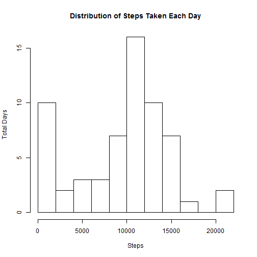
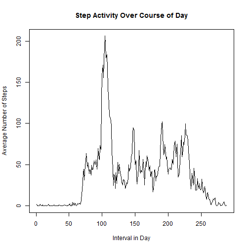
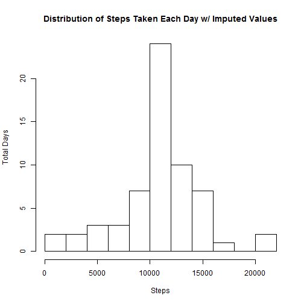
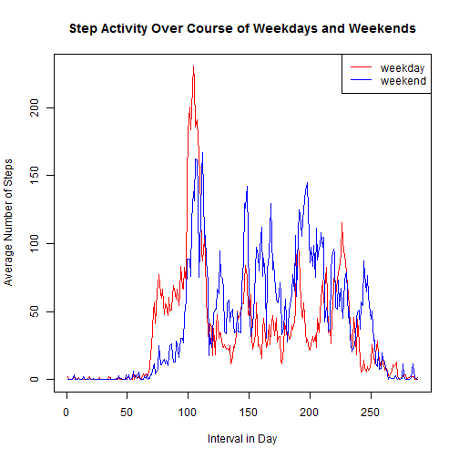

#Peer Graded Assignment 1

## dengelberg 1/19/2017

First read the data to R


```r
activityData <- read.csv('./activity.csv')
```


##What is mean total number of steps taken per day?

Now we will make a histogram of steps in each day


```r
stepDays <- with(activityData, tapply(steps, date, sum, na.rm = TRUE))
hist(stepDays, breaks = 8, xlab = "Steps", ylab = "Total Days",
     main = "Distribution of Steps Taken Each Day")
```



We then calculate the mean and median


```r
meanSteps <- mean(stepDays)
medianSteps <- median(stepDays)
```

The mean of steps is 9354.2295082 and the median of steps is 10395.

##What is the average daily activity pattern?

Lets figure out how steps vary over the course of the day.


```r
stepIntervals <- with(activityData, tapply(steps, interval, mean, na.rm = TRUE))
maxSteps <- which(stepIntervals == max(stepIntervals))
maxIntv <- as.numeric(names(maxSteps))
plot(stepIntervals, type = 'ln', xlab = "Interval in Day", ylab = "Average Number of Steps", main = "Step Activity Over Course of Day")
```

```
## Warning in plot.xy(xy, type, ...): plot type 'ln' will be truncated to
## first character
```




The maximum average steps is 104 in interval 835.

##Imputing missing values


```r
missCount <- sum(is.na(activityData$steps))
```

The number of missing values is 2304.

Next we want to replace all the NA values with teh average value for that time interval. We then create a new histogram.


```r
activities2 <- activityData
for(i in 1:length(activities2$steps)){
        if(is.na(activities2$steps[i])){
                interval <- activities2$interval[i]
                activities2$steps[i] <- stepIntervals[as.character(interval)]
        }
}
stepDays2 <- with(activities2, tapply(steps, date, sum, na.rm = TRUE))
hist(stepDays2, breaks = 8, xlab = "Steps", ylab = "Total Days", main = "Distribution of Steps Taken Each Day w/ Imputed Values")
```



We then calculate our new mean and median


```r
meanSteps <- mean(stepDays)
medianSteps <- median(stepDays)
```

The mean of steps is 9354.2295082 and the median of steps is 10395.

##Are there differences in activity patterns between weekdays and weekends?

We first need to create a new variable that distinguished weekday from weekend.


```r
activities2$daytype <- weekdays(as.POSIXct(activities2$date))
weekdays1 <- c('Monday', 'Tuesday', 'Wednesday', 'Thursday', 'Friday')
for(i in 1:length(activities2$daytype)){
        if(activities2$daytype[i] %in% weekdays1){
                activities2$daytype[i] <- "weekday"
        } else {
                activities2$daytype[i] <- "weekend"
        }
}
```

Now we create the plot of activity over weekdays and weekends.


```r
library(dplyr)
```

```
## 
## Attaching package: 'dplyr'
```

```
## The following objects are masked from 'package:stats':
## 
##     filter, lag
```

```
## The following objects are masked from 'package:base':
## 
##     intersect, setdiff, setequal, union
```

```r
weekendAct <- filter(activities2, daytype == "weekend")
weekdayAct <- filter(activities2, daytype == "weekday")
weekendIntervals <- with(weekendAct,
                         tapply(steps, interval, mean, na.rm = TRUE))
weekdayIntervals <- with(weekdayAct,
                         tapply(steps, interval, mean, na.rm = TRUE))
plot(weekdayIntervals, type = 'ln', xlab = "Interval in Day",
     ylab = "Average Number of Steps",
     main = "Step Activity Over Course of Weekdays and Weekends",
     col = "red")
```

```
## Warning in plot.xy(xy, type, ...): plot type 'ln' will be truncated to
## first character
```

```r
points(weekendIntervals, type = 'ln', col = "blue")
```

```
## Warning in plot.xy(xy.coords(x, y), type = type, ...): plot type 'ln' will
## be truncated to first character
```

```r
legend("topright", c("weekday","weekend"), lty = c(1,1), col = c("red","blue"))
```


